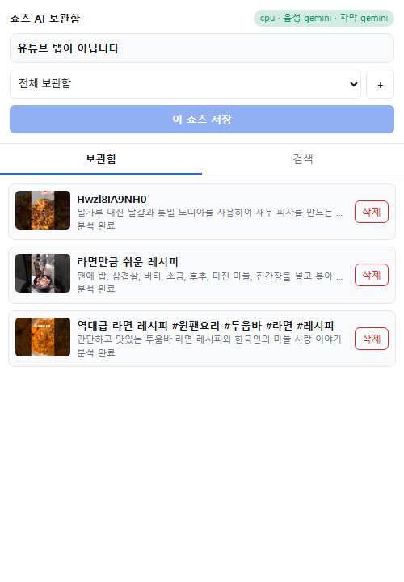
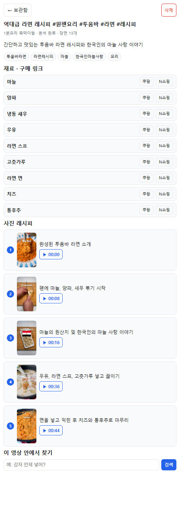

# 쇼츠 AI 보관함 — Demo

마스터 문서(확정본)의 파이프라인을 **한 노트북에서 끝까지 돌아가게** 만든 최소 구현입니다.
저장 → 추출 → 분석 → 요약 → 검색 → 시점 이동까지 전 구간이 이어집니다.

**서버는 유튜브에 한 번도 접속하지 않습니다.** 화면과 소리는 확장프로그램이
브라우저에서 뽑아 올립니다(마스터 문서 2장).

```
크롬 확장 (Side Panel)
   │ ① 저장 버튼 → 메타데이터 접수
   │ ② 재생하며 프레임(0.5초마다) + 오디오 추출 → 서버로 업로드   ★ 핵심
   ▼
API 서버 (FastAPI) → 작업 큐 → Worker
                                ├ 단계 4  음성 받아적기   (WhisperX / demo: Gemini)
                                ├ 단계 5  화면 글자 읽기  (EasyOCR / demo: Gemini 그리드)
                                ├ 단계 6  장면 설명       (Gemini, 6장→1장, 영상당 3회 이하)
                                ├ 단계 7  4초 장면 카드
                                ├ 단계 8  글 좌표 + 그림 좌표 → Qdrant
                                └ 단계 9  전체 요약
   │ 3초마다 진행률 확인
   ▼
검색 → 하이브리드(글·단어·그림) + user_id 필터 → RAG 답변 → 클릭하면 그 초로 이동
```

---

## 미리보기

<p align="center">
  
  
</p>

### 최근 업데이트

| 기능 | 설명 |
| --- | --- |
| 제목·채널 추출 안정화 | 화면에 보이는 reel 만 읽어 preload 된 다른 쇼츠의 제목·채널이 섞이는 문제 수정 |
| 재료 → 구매 링크 | 요약할 때 재료 목록을 함께 추출 → 재료마다 쿠팡/네이버쇼핑 검색 버튼. `.env` 에 `NAVER_CLIENT_ID/SECRET`(무료)을 넣으면 최저가·판매처 표시 |
| 사진 레시피 | 주요 단계를 번호 배지 + 스틸컷 + 단계 설명 + ▶시점 버튼 카드로 표시. 프레임이 이미 저장돼 있어 서버 변경 없음 |

> 예전에 분석한 영상은 재료가 비어 있습니다. 다시 저장할 필요 없이
> `python -m tools.backfill_ingredients` 한 번이면 채워집니다.

---

> ### 🚀 처음 받았다면 (팀원용 요약)
>
> 1. `python -m venv .venv` → `.venv\Scripts\activate` → `pip install -r requirements.txt`
> 2. **본인 Gemini 키를 발급받으세요** → https://aistudio.google.com/apikey (무료)
> 3. `.env.example` 을 `.env` 로 복사하고 `GEMINI_API_KEY=` 에 붙여넣기
> 4. `python -m uvicorn server.main:app --port 8000`
> 5. `chrome://extensions` → 개발자 모드 → `extension` 폴더 로드
> 6. **다른 유튜브 확장 전부 끄기** ← 안 끄면 원인 불명 버그로 며칠 날립니다
>
> `.env` 는 저장소에 없습니다(각자 키를 씁니다). 도커·GPU 없이 그냥 돕니다.
> 잘 안 되면 `python -m tools.e2e_test` 로 어디서 막히는지 먼저 보세요.

---

## 1. 실행 방법

### 서버

```bash
cd shorts-vault-demo
python -m venv .venv
.venv\Scripts\activate            # macOS/Linux: source .venv/bin/activate
pip install -r requirements.txt

copy .env.example .env            # macOS/Linux: cp .env.example .env
# .env 에 GEMINI_API_KEY 를 채우세요 (https://aistudio.google.com/apikey)

python -m uvicorn server.main:app --port 8000
```

`http://localhost:8000/docs` 에서 API 를 직접 눌러볼 수 있습니다.

> **도커는 필요 없습니다.** Qdrant 를 `data/qdrant` 폴더에 로컬 파일로 돌립니다.
> 4명이 창고를 공유할 때만 `.env` 에 `QDRANT_URL` 을 넣으세요.

### 크롬 확장

1. `chrome://extensions` 열기 → 오른쪽 위 **개발자 모드** 켜기
2. **압축해제된 확장 프로그램을 로드합니다** → `extension` 폴더 선택
3. 유튜브 쇼츠를 열고 확장 아이콘 클릭 → 오른쪽에 Side Panel 이 열립니다

> ⚠ **다른 유튜브 확장을 전부 끄세요.** 마스터 문서 6장의 경고대로 충돌이 납니다.
> 개발 전용 크롬 프로필을 따로 만드시길 권합니다.

## 2. 확인 도구 — 어디까지 되는지 단계별로

```bash
# ① Gemini 없이: 장면 카드 합치기 / 검색 비중 / 중복 제거
python -m tools.smoke_test

# ② 사용자 격리 — 남의 영상이 내 검색에 나오지 않는지  ★ 보안 핵심
python -m tools.test_user_isolation

# ③ 쓸 수 있는 Gemini 모델과 응답 속도 (503 이 나면 여기부터)
python -m tools.check_models

# ④ Gemini 연동 4곳 (캡션·OCR / 음성 / 글 좌표 / RAG)
python -m tools.check_gemini

# ⑤ 서버 전 구간 e2e — 확장 없이 가짜 프레임으로 업로드→분석→검색→삭제
#    (다른 창에서 서버를 먼저 띄워두세요)
python -m tools.e2e_test
```

**①~⑤가 다 통과하면 서버 쪽은 끝입니다.** 남는 건 브라우저 추출(단계 2)뿐이고,
그건 실제 쇼츠에서 저장 버튼을 눌러봐야 알 수 있습니다.

## 3. 시연 시나리오 (마스터 문서 10장 그대로)

1. 유튜브 쇼츠를 연다
2. 확장 아이콘 클릭 → Side Panel 열림
3. (선택) `＋` 로 재생목록을 만들고 고른다
4. **이 쇼츠 저장** → "영상을 재생하며 분석 준비 중" 진행바 (영상 길이만큼)
5. 업로드 후 진행률 20 → 40 → 65 → 85 → 95 → 100%
6. 완료되면 카드에 요약 한 줄. 카드를 누르면 상세 — 주요 단계 시각 버튼
7. **검색** 탭에서 `감자 언제 넣어?` → AI 답변 + 장면 목록(장면 사진 포함)
8. `▶ 00:22` 클릭 → 유튜브 영상이 그 지점부터 재생 (1.5초 일찍)
9. 다른 쇼츠를 보던 중이면 그 영상으로 옮긴 뒤 이동, 실패하면 새 탭 폴백
10. 카드의 **삭제** → 표·창고·이미지 3곳에서 지워짐

## 4. 코드 구조 — 담당별 경계

| 파일 | 마스터 문서 | 담당 |
| --- | --- | --- |
| `extension/content.js` | 단계 1·2·13 — **프레임·오디오 추출**, 시점 이동 | **A** |
| `extension/sidepanel.js` | 단계 11 — 화면 전부 | **A** |
| `server/main.py`, `server/db.py`, `server/media.py`, `server/pipeline/worker.py` | 단계 3·10 | **B** |
| `server/pipeline/transcribe.py` | 단계 4 WhisperX | **C** |
| `server/pipeline/ocr.py` | 단계 5 OCR | **C** |
| `server/pipeline/segmenter.py` | 단계 7 장면 카드 | **C** |
| `server/pipeline/caption.py`, `server/pipeline/frames.py` | 단계 6 Gemini 캡션 | **D** |
| `server/embedder.py`, `server/image_embedder.py`, `server/vectors.py` | 단계 8 좌표 | **D** |
| `server/search.py` | 단계 12 하이브리드 검색 + RAG | **D** |

각 파일은 **입출력 모양만 지키면 내부를 통째로 바꿔도** 나머지가 안 깨집니다.
장면 카드 모양은 마스터 문서 6장 견본과 동일합니다:

```json
{
  "segment_id": "vid_001_seg_006",
  "start_time": 22.4,
  "end_time": 26.4,
  "asr_text": "이제 감자를 넣어줍니다",
  "ocr_text": "감자 300g",
  "caption": "손질된 감자를 프라이팬에 넣는 모습",
  "frame_path": "frames/00022000.jpg"
}
```

프레임 파일 이름이 곧 시각입니다: `00022000.jpg` = 22.0초

## 5. 진짜 모델로 갈아끼우기

`.env` 한 줄씩만 바꾸면 됩니다. 코드는 안 건드립니다.

| 단계 | demo 기본값 | 진짜 | 바꾸는 법 | 담당 |
| --- | --- | --- | --- | --- |
| 4 음성 | Gemini | WhisperX | `pip install whisperx` → `ASR_BACKEND=whisperx` | C |
| 5 자막 | Gemini 그리드 | EasyOCR | `pip install easyocr` → `OCR_BACKEND=easyocr` | C |
| 8 글 좌표 | Gemini 768차원 | BGE-M3 1024차원 | `pip install FlagEmbedding` → `TEXT_EMBED_BACKEND=bge` | D |
| 8 그림 좌표 | 없음 | SigLIP2 | `pip install torch transformers peft` → `IMAGE_EMBED_BACKEND=siglip` | D |
| GPU | `DEVICE=cpu` | `DEVICE=cuda` | **이 한 줄만** (마스터 문서 8장) | B |

> ⚠ 좌표 백엔드를 바꾸면 벡터 차원이 달라집니다. `data/qdrant` 를 지우고
> 저장된 영상을 다시 분석해야 합니다.

## 6. 하이브리드 검색 — 실험할 지점

`server/search.py` 의 `WEIGHTS` 가 마스터 문서 단계 12 의 비중 표입니다.

```python
WEIGHTS = {
    "speech":  (0.5, 0.3, 0.2),  # "감자 언제 넣어?"
    "visual":  (0.3, 0.1, 0.6),  # "빨간 냄비 나오는 장면"
    "lexical": (0.3, 0.5, 0.2),  # "300g", "2큰술"
}   #  글 좌표, 정확한 단어, 그림 좌표
```

검색 응답에 `score_dense` / `score_lexical` / `score_image` 가 각각 들어옵니다.
**9장 실험의 "정보원별 기여도"는 이 값을 끄고 켜면서 재면 됩니다.**

각 영상의 요약에는 `timings` 가 저장됩니다 — "처리 시간 분해" 실험용입니다.

## 7. Demo 에서 줄인 것

| 마스터 문서 | Demo | 바꾸는 법 |
| --- | --- | --- |
| PostgreSQL | SQLite (`data/vault.db`) | `server/db.py` 함수 시그니처 유지하며 교체 (B) |
| 작업 큐 (Redis) | 서버 안 asyncio 큐 | `worker.enqueue()` 만 교체 (B) |
| Qdrant Cloud | 로컬 파일 모드 | `.env` 에 `QDRANT_URL` |
| 로그인 | `X-User-Id` 헤더 (확장이 만든 uuid) | `main.current_user()` 교체 (B) |

## 8. 알려진 제약

- **추출은 실시간 재생입니다.** 60초 영상이면 추출도 60초. 그동안 그 탭에 머물러야 합니다.
- 서버에 `ffmpeg` 가 필요 없습니다. 확장이 오디오를 16kHz wav 로 만들어 보냅니다.
- `content.js` 가 서버로 직접 업로드하므로 CORS 에 `youtube.com` 이 열려 있습니다.
  공용 서버에 올릴 때는 Cloudflare Tunnel + 출처 정리가 필요합니다(마스터 문서 11장).
- 로컬 Qdrant 는 **프로세스 하나만** 붙을 수 있습니다. `--reload` 로 서버가 두 번 뜨면
  잠금 충돌이 날 수 있으니, 이상하면 서버를 완전히 끄고 다시 켜세요.
- Gemini 최신 모델은 붐빌 때 503 이 납니다. 키 문제가 아니라 구글 쪽 일시 과부하입니다.
  `python -m tools.check_models` 로 그날 잘 도는 모델을 고르세요.
